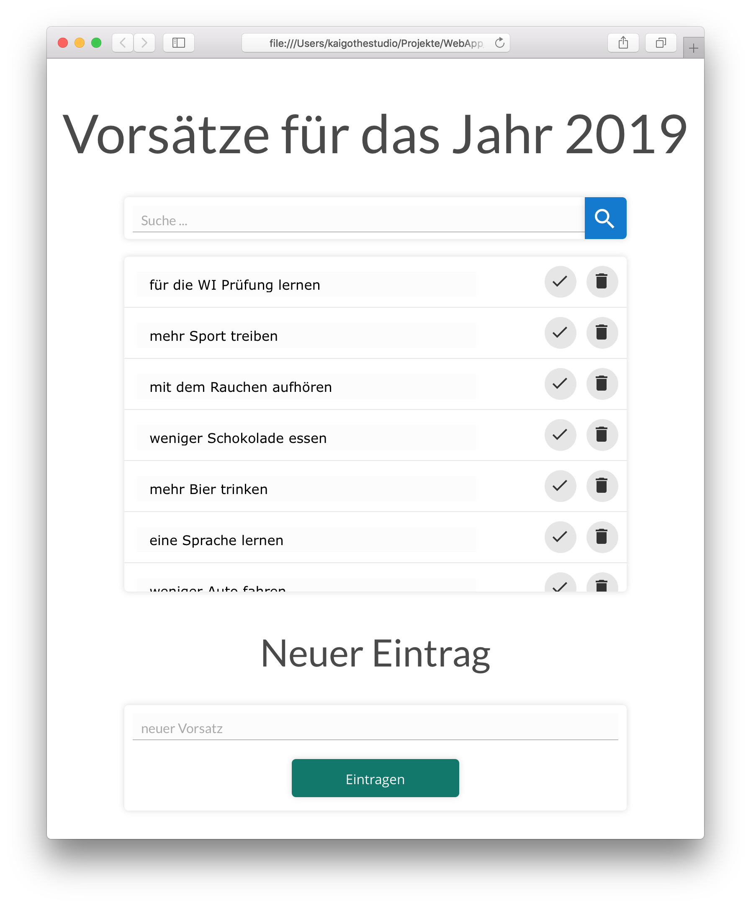

# WebApp Vorlesung WI



# Allgemein

Die App besteht aus zwei teilen: der Server-API und dem Web Client.


# Server-API 
Die API besteht aus einem node.js Server mit mySQL Anbindung. Es werden haupsächlich PSot request verarbeitet, wobei die Antwort in JSON formatiert ist. 
die API kann auf einem lokalem Rechner laufen. (Voraussetztung node.js ist installiert)


## die Sturktir der Datenbank 

### User 

```

CREATE TABLE `user` (
  `iduser` int(11) NOT NULL AUTO_INCREMENT,
  `name` varchar(50) NOT NULL,
  `created` timestamp NOT NULL DEFAULT CURRENT_TIMESTAMP,
  PRIMARY KEY (`iduser`),
  UNIQUE KEY `iduser_UNIQUE` (`iduser`),
  UNIQUE KEY `name_UNIQUE` (`name`)
) ENGINE=InnoDB AUTO_INCREMENT=7 DEFAULT CHARSET=utf8mb4 COLLATE=utf8mb4_0900_ai_ci

```

### Task

```
CREATE TABLE `user` (
  `iduser` int(11) NOT NULL AUTO_INCREMENT,
  `name` varchar(50) NOT NULL,
  `created` timestamp NOT NULL DEFAULT CURRENT_TIMESTAMP,
  PRIMARY KEY (`iduser`),
  UNIQUE KEY `iduser_UNIQUE` (`iduser`),
  UNIQUE KEY `name_UNIQUE` (`name`)
) ENGINE=InnoDB AUTO_INCREMENT=7 DEFAULT CHARSET=utf8mb4 COLLATE=utf8mb4_0900_ai_ci
```

## Requests

### User 

**POST**:`http:localhost:3000/api/v1/user/`

Body


### Task 

**POST**:`http:localhost:3000/api/v1/task/`

